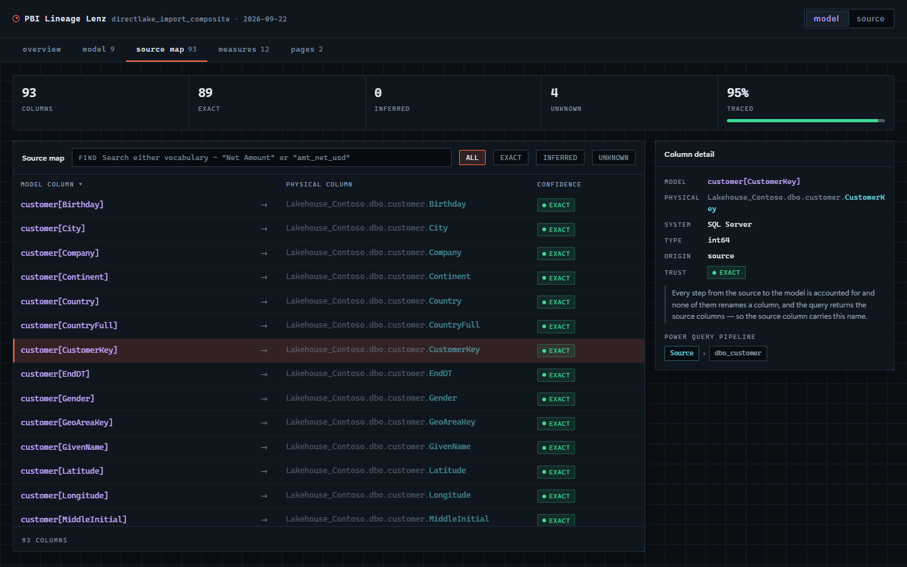
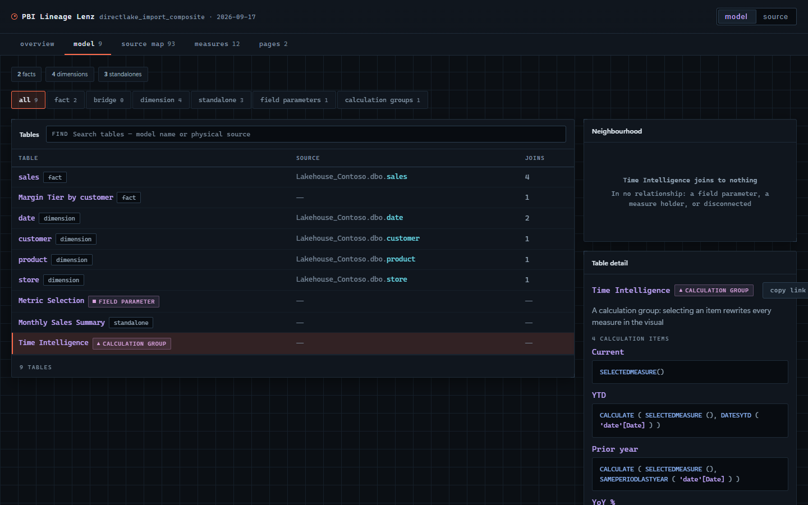
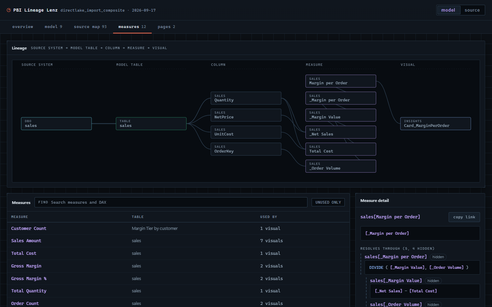
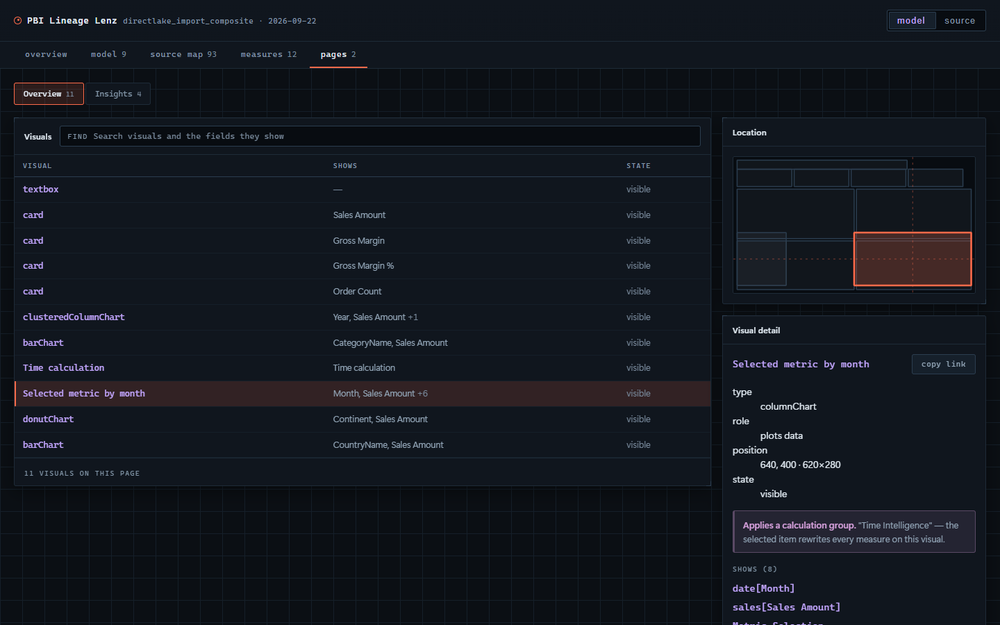
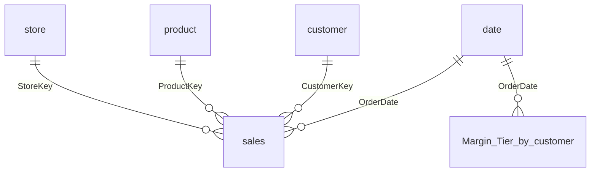

# PBI Lineage Lenz

**Find the lineage. Understand the model. Document both.**

Trace any number on a Power BI report back to the physical column it came from, read a
model you did not build, and generate documentation that cannot go stale — then send the
whole picture, as one HTML file, to someone who has never opened Power BI.

[**▶ See a live example**](https://jonathanjihwankim.github.io/pbi-lineage-lenz/demo.html) —
a real model, in your browser, nothing to install.



Free and open source. No paid tier, no login, no server.

---

## The problem

A data engineer knows `Lakehouse_Contoso.dbo.customer.CustomerKey`.
A Power BI developer knows `customer[CustomerKey]`.

They are the same column, and nothing in either person's tooling says so. Every *"where
does this number actually come from?"* becomes a meeting.

You can work it out by hand — open the PBIP, find the table, read the Power Query steps,
follow the renames, then hunt for the visuals that use the measure that reads the column.
It takes an afternoon, and it is stale the following week. So nobody does it.

And that is the second half of the same problem: **almost no semantic model is
documented.** Not because people are careless, but because documentation written by hand is
obsolete the moment someone adds a column — so the effort is spent once, trusted for a
month, and quietly abandoned. What survives is tribal knowledge and a person who is on
holiday.

Documentation generated *from the model itself* cannot drift, because there is nothing to
keep in step. Regenerate it in CI and it is correct on every commit, or it is not there at
all — and either of those is better than a wiki page that is confidently wrong.

## What this is for

Three things, and deliberately not more. This consolidates three earlier tools, but it is
not a pile of all their features — anything that did not serve one of these did not get
built.

| | |
|---|---|
| **Find the lineage, correctly** | From a visual on a page, through the measure, through the DAX, through every Power Query step, to the physical table and column. *Correctly* is the hard part, and it is where nearly all the work went. |
| **Understand the model like a lens** | Which tables are facts, which are dimensions, what joins to what, what a measure really depends on — for a model you did not build. |
| **Documentation that cannot go stale** | Generated from the model, not written about it: markdown with an ER diagram that renders in a pull request, or one self-contained HTML file. Regenerate it in CI and it is right on every commit. |

---

## Main features

### Four lenses over one model

| Lens | The question it answers |
|---|---|
| **Model** | What am I looking at? Which tables are facts, which are dimensions, and what joins to what? |
| **Source map** | Which physical column is behind this model column — and how sure are we? |
| **Measures** | What is the DAX, which physical columns does it read, and which visuals show it? |
| **Pages** | What is on this report page, and where exactly is this visual? |

**Model** — table roles are read from the *direction* of relationships, not from names. A
table that only originates joins is a fact; one that only receives them is a dimension.
`_fct` and `_dim` line up in one model and will not in the next.



**Measures** — the DAX, the physical columns underneath it, and every visual that shows it,
each located on its page. That last one is the question that decides whether a change is
safe.



**Pages** — nothing is ever filtered out. Hidden visuals are listed with the bookmark that
reveals them, because that is exactly where field parameters and calculation groups live.



### The handoff file

Click **Export handoff** and get **one HTML file**. No Power BI, no project folder, no
install, no network access — it opens in any browser on any OS and fetches nothing.

Only the person producing it needs Chrome or Edge. Everyone reading it needs a browser.

Every measure and column has a link you can paste straight into a chat.

### Documentation that regenerates itself

```bash
npx pbi-lineage-lenz docs ./MyReport -o MODEL.md
```

**A markdown file you commit next to the PBIP**, so the model is readable in a pull request
by someone who will never open Power BI. Every table with its physical source, every
measure with its DAX and the columns underneath it, every relationship, every report page —
and an **ER diagram GitHub renders inline**, which is the part that makes a reviewer
actually look.

This is the diagram from `samples/contoso`, generated by the command above and pasted here
unedited:



Tables in no relationship at all — field parameters, measure holders — are left out of the
diagram on purpose and listed in the table section instead. In one real model that was 20
of 61 tables, and drawing them would have been 20 disconnected boxes carrying no shape.

It leads with the summary a reader needs before any table listing means anything:

> **83 of 87 columns** that read from a source are traced to a physical column (95%), and
> **1** more are computed and have no source at all.
>
> Confidence in those answers: 84 stated, 0 assumed, 4 unresolved.

Three formats, for three audiences:

| | |
|---|---|
| `--format md` | Commit it. Diffable, reviewable, renders on GitHub. **The default.** |
| `--format html` | The handoff file — for someone who wants to click, not read. |
| `--format json` | The parsed model, for building your own thing on top. |

**Why generated rather than written:** a hand-written data dictionary is wrong the first
time someone renames a column, and nobody finds out until a decision has already been made
on it. Put `docs` in CI and the documentation is a build artefact — regenerated on every
commit, or absent. It cannot quietly rot into fiction.

### A CI gate people keep switched on

`check` fails the build on a broken reference and *reports* everything else, because a gate
that fails on judgement calls gets disabled within a week — and a disabled gate catches
nothing.

### Both names, everywhere

Every column carries its model name and its physical name side by side, with an honest
label on the mapping. Press **S** to swap which vocabulary leads.

---

## Quick start

### 1. Look at the example — 10 seconds, nothing to install

**[Open the live demo →](https://jonathanjihwankim.github.io/pbi-lineage-lenz/demo.html)**

A real Contoso model with a Fabric Lakehouse behind it. Click through the four lenses.
This is also exactly what a handoff file looks like when somebody sends you one.

### 2. Open your own model — 1 minute

**[Open the web app →](https://jonathanjihwankim.github.io/pbi-lineage-lenz/)** and click
**Open a PBIP folder**.

- **Which folder?** The one holding your `.SemanticModel` and `.Report` folders — where
  your `.pbip` file sits. The `.SemanticModel` folder on its own also works.
- **Is anything uploaded?** No. The folder is read in the page, parsed in the page, and
  rendered in the page. There is no server to send it to.
- **Which browsers?** Chrome and Edge get a proper folder picker. Firefox and Safari work
  through a file picker; the only thing they lose is choosing where an export saves.

### 3. Hand it to a data engineer — 1 minute

Click **Export handoff** and send the file. That is the whole workflow. They need no Power
BI, no access to your workspace, and no install.

Prefer machine-readable? **Export JSON** gives you the same parsed model the page is
rendering.

### 4. Do it from the command line

```bash
# The hero, scriptable
npx pbi-lineage-lenz handoff ./MyReport -o handoff.html

# Documentation to commit beside the PBIP — includes a mermaid ER diagram
# that GitHub renders inline, so the model is readable in a pull request
npx pbi-lineage-lenz docs ./MyReport -o MODEL.md

# CI gate — exits 1 on a broken reference
npx pbi-lineage-lenz check ./MyReport

# What changed about the model, not which lines moved
npx pbi-lineage-lenz diff main..HEAD
```

Point any command at the project root, the `.SemanticModel` folder, or a bare `definition`
folder. If a folder holds several reports — a Fabric workspace synced to git usually does —
it reads each report's `definition.pbir`, pairs it with the model that report actually
names, and tells you which one it chose.

Try it against the bundled sample right now:

```bash
git clone https://github.com/JonathanJihwanKim/pbi-lineage-lenz
cd pbi-lineage-lenz && npm install
node packages/cli/src/bin.js handoff samples/contoso -o handoff.html
```

### 5. Commit the documentation beside the model — 1 minute

```bash
npx pbi-lineage-lenz docs ./MyReport -o MODEL.md
git add MODEL.md && git commit -m "Regenerate model documentation"
```

Now the model is readable **in the pull request itself**. A reviewer sees the ER diagram
rendered, and the diff shows what changed about the model — a measure's DAX, a
relationship, a column's physical source — beside the TMDL that changed it.

Regenerate it in CI on every merge and it is documentation nobody has to remember to
update:

```yaml
- run: npx --yes pbi-lineage-lenz docs . -o MODEL.md
# Fails if the committed file no longer matches the model. The generated file carries a
# date stamp, so `-I` ignores that one line — otherwise this would fail every midnight
# and be switched off within a week.
- run: git diff --exit-code -I'^_Generated' MODEL.md
```

### 6. Put the gate in CI

```bash
npx pbi-lineage-lenz check ./MyReport                          # broken references only
npx pbi-lineage-lenz check ./MyReport --min-coverage 70        # also require 70% traced
npx pbi-lineage-lenz check ./MyReport --fail-on broken,dangling-visuals
```

| rule | what it finds | fails the build |
|---|---|---|
| `broken` | DAX reading a column or measure that does not exist | **yes** |
| `dangling-visuals` | a visual referencing a measure that does not exist | no |
| `unused` | measures nothing reaches, following measure-to-measure references | no |
| `coverage` | columns with no physical source | only with `--min-coverage` |
| `dead-visuals` | hidden visuals that no bookmark reveals | no |

`dangling-visuals` is separate from `broken` because it fails *quietly*: a measure whose
DAX reads a deleted column errors, while a card whose dynamic label references a deleted
measure just renders blank. One real report carried 12 of these and nobody had noticed.

[`.github/workflows/handoff.yml`](.github/workflows/handoff.yml) is a ready-made workflow:
it runs the gate on every PR, builds a handoff file, and comments a download link plus a
summary of what changed about the model.

---

## Reading the confidence labels

This is the part a data engineer will judge the whole tool on, so it is worth thirty
seconds.

| label | meaning |
|---|---|
| **`exact`** | The source name is **stated by the model** — a rename pair written down, a projection, a native-SQL select list, a Direct Lake partition, or a chain in which every step is accounted for and none of them *can* rename a column. |
| **`inferred`** | The chain contains a step the tool cannot read, so the name is **assumed** to pass through unchanged. Usually right. Still an assumption. |
| **`unknown`** | No physical table could be established. It says so instead of guessing. |

**A tool that quietly guesses is worse than one that admits the gap**, because you cannot
tell which rows to trust.

Completeness is tracked separately from confidence. A calculated table built with `UNION`
draws one column from several facts and DAX records only the first — so the path shown is
right but partial, and the row says `+1 more` rather than reading as the whole answer.

---

## How much to trust it

Two real models, both asserted in the test suite, so a parser change that quietly collapses
them fails the build.

**The bundled sample** — Contoso on a Fabric Lakehouse: 7 tables, 12 visuals, committed at
[`samples/contoso/`](samples/contoso/) so you can reproduce every number yourself:

- **95%** of source-backed columns traced, **none assumed**
- Direct Lake, import and calculated tables all resolved
- 0 broken references, 0 dangling visual references

**A real production report** — 61 tables, 473 columns, 274 measures, 542 visuals:

- **384 of 467** columns that read from a source traced to a physical column (**82%**),
  every one **stated** rather than assumed
- **0** broken references, after eight parser fixes each of which the tool found in itself
  — the first version reported 166, and every one was an artefact
- **14** measures nothing reaches, following measure-to-measure references rather than
  direct visual bindings; the direct-only reading claimed 101
- **2** genuinely dead visuals out of 17 hidden ones; the other 15 have a named bookmark

Synthetic fixtures were all green while real-world resolution sat at 0.2%. That is why
there is a real model in the loop, and why the sample above ships with the code.

---

## Become a sponsor

**This is free, and it stays free.** No paid tier, no feature behind a login, no
"enterprise edition". If you ever find one, that is a bug.

Sponsorship buys recognition, priority triage, and a say in the roadmap — never
functionality. [SPONSORS.md](SPONSORS.md) says exactly what it does and does not buy.

[](https://github.com/sponsors/JonathanJihwanKim)
[](https://buymeacoffee.com/jihwankim)

If your organisation depends on this, sponsoring is what keeps it maintained by someone who
uses it in production.

---

## Related projects

Both still maintained, as focused single-purpose tools:

- [**pbip-documenter**](https://github.com/JonathanJihwanKim/pbip-documenter) — deep PBIP
  documentation, detailed ERDs, drawio and mermaid export
- [**pbip-lineage-explorer**](https://github.com/JonathanJihwanKim/pbip-lineage-explorer) —
  interactive D3 lineage tree, git diff, VS Code extension

Use this one when you want the source-system bridge and the handoff file.

## Contributing

A bug report naming a PBIP shape the tool got wrong is the most valuable thing you can
send. See [CONTRIBUTING.md](CONTRIBUTING.md).

## Development

```bash
npm install
npm test                # 564 tests, on Linux and Windows
npm run dev             # the web app
npm run build           # the web app, for GitHub Pages
```

```
packages/core      parsing, naming, graph, diff — platform independent
packages/viewer    read-only UI; no file I/O, no network
packages/handoff   one self-contained HTML file from a parsed model
packages/export    markdown, mermaid ERD, and JSON
packages/cli       npx pbi-lineage-lenz
apps/web           the browser app
samples/contoso    the model behind every screenshot above
```

`packages/viewer` is the pivot: the web app and the handoff file mount the identical
component, which is what makes a handoff cheap to produce and identical to read.

## Security and privacy

The web app reads local files and transmits nothing. See [SECURITY.md](SECURITY.md).

## License

MIT © Jihwan Kim
