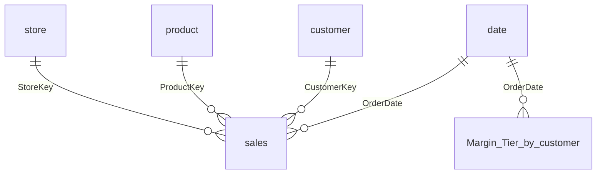

# Documentation that cannot go stale

[← back to the README](../README.md)

Almost no semantic model is documented. Not because people are careless, but because
documentation written by hand is obsolete the moment somebody adds a column — so the effort
is spent once, trusted for a month, and quietly abandoned. What survives is tribal knowledge
and a person who is on holiday.

Documentation generated *from the model itself* cannot drift, because there is nothing to
keep in step. Regenerate it in CI and it is correct on every commit, or it is not there at
all — and either of those is better than a wiki page that is confidently wrong.

```bash
pbi-lineage-lenz docs ./MyReport -o MODEL.md
```

That is the whole command. The rest of this page is what comes out of it.

---

## What the file contains

| Section | What it answers |
|---|---|
| **Overview** | How big the model is, how much of it is traced, how sure the tool is — and the columns that genuinely could not be traced, listed by name. |
| **Data sources** | Every connector, with the server and database resolved through parameters. |
| **Model shape** | An ER diagram GitHub renders inline, plus bidirectional, inactive and dangling relationships. |
| **Tables** | Each table with its physical source, every column beside its physical column — or the reason it has none — how many measures and visuals use it, and the Power Query steps between them. |
| **Measures** | Every measure, its DAX, the hidden measures it resolves through, and how many visuals show it. |
| **Calculation groups** | Each group, each item, and the DAX it applies — see below. |
| **Field parameters** | Each parameter and every field it offers. |
| **Report pages** | Each page and how many visuals sit on it — with `--page-maps`, a picture of where each visual is. |

### Five formats, for four audiences

| | |
|---|---|
| `--format md` | Commit it. Diffable, reviewable, renders on GitHub. **The default.** |
| `--format html` | The handoff file — for someone who wants to click, not read. |
| `--format json` | The parsed model, for building your own thing on top. |
| `--format csv` | One row per binding, for joining lineage to a catalog or loading it into a semantic model. |
| `--format ndjson` | The same rows, one JSON object per line. |

The JSON, CSV and NDJSON shapes are a documented contract: **[output-contract.md](output-contract.md)**.

---

## Alias measures, read through

A mature model is full of measures whose whole body is one line:

```dax
[_Margin per Order]
```

Documentation that prints that has documented nothing. The logic is in the hidden measures
below it — hidden on purpose, because the field list is a product surface — so the generated
file reads through them instead, without anyone unhiding anything:

```markdown
### sales[Margin per Order]

​```dax
[_Margin per Order]
​```

<details><summary>Resolves through 5 references (4 hidden)</summary>

- `sales[_Margin per Order]` — measure, hidden
  DIVIDE ( [_Margin Value], [_Order Volume] )
  - `sales[_Margin Value]` — measure, hidden
    [_Net Sales] - [Total Cost]
  - `sales[_Order Volume]` — measure, hidden
    DISTINCTCOUNT ( 'sales'[OrderKey] )
  …
</details>
```

Breadth-first, so it reads in resolution order; collapsed, because most readers want the
headline expression. A reviewer can now see what a KPI computes without a Power BI licence,
and see that a change to a hidden measure moves three visible ones before approving it.

---

## A whole workspace

```bash
pbi-lineage-lenz docs ./workspace --all -o lineage/
```

A Fabric workspace synced to git holds many reports over a few shared models, and the
questions that matter span them: *which reports show this measure? which of the five thin
reports over this model use it?* One report at a time cannot answer either by construction.

`--all` reads every `definition.pbir`, pairs each report with the model it names, and parses
each shared model **once**. It writes `index.md` — every report and how it paired, every
model and the reports reading it, and for each shared model a table of which reports reach
each measure — plus one document per report under `reports/`.

A report whose model is not in the folder, or that connects to a published model
(`byConnection`), is listed with the reason rather than skipped. One report that cannot be
read is reported and the rest go on.

`--all` works with `md`, `json`, `csv` and `ndjson`.

---

## The ER diagram

Mermaid, because GitHub renders it inline. A diagram that needs a viewer is a diagram nobody
opens, and the point of committing this beside the PBIP is that a reviewer sees the model
without installing anything.

This is the diagram from [`samples/contoso`](../samples/contoso/), generated by the command
above and pasted here unedited:



Tables in no relationship at all — field parameters, calculation groups, measure holders —
are left out of the diagram on purpose and listed in the table section instead. In one real
model that was 20 of 61 tables, and drawing them would have been 20 disconnected boxes
carrying no shape.

Above 40 related tables the diagram stops being readable and starts being a hairball, so it
gives way to the relationship table rather than rendering something useless.

---

## Calculation groups and field parameters

These two are the reason a *generated* document beats a written one by more than freshness.
Both are invisible from every other direction.

A calculation group is not a measure, so a measure listing skips it. Its table has no
physical source, so a source map has nothing to say about it. Its effect appears on visuals
that never name it. A reader asking *"why does this card show year-to-date when the measure
has no time intelligence in it?"* cannot answer that from anything else in the file.

So the generated document says it outright:

```markdown
## Calculation groups

Selecting an item from one of these rewrites every measure in the visual it is applied to.
The measure's own DAX does not change and does not mention it.

### Time Intelligence

Applied by **1** visual: Selected metric by month (Overview).

#### YTD

​```dax
CALCULATE ( SELECTEDMEASURE (), DATESYTD ( 'date'[Date] ) )
​```
```

And every measure such a group rewrites carries a note under its own DAX, so somebody
editing that measure and checking the visual is told why the two disagree.

Field parameters get the same treatment in reverse. A visual bound to one names the
parameter and stops — the report says *"this well holds prmMeasures"* where the truth is
*"a slicer here reaches any of 22 measures"*. The document lists all of them, and counts how
many visuals each parameter is bound by.

Fields a parameter offers that the model no longer contains are **dropped rather than
listed**. That is a broken reference, and inventing a row for it would hide it. `check`
reports it instead, under `broken-nameof`, and fails the build on it.

See [calculation-groups-and-field-parameters.md](calculation-groups-and-field-parameters.md)
for what the tool can and cannot see.

---

## The summary it leads with

Before any table listing means anything, the reader needs to know how much of it to trust:

> **384 of 402 columns** that read from a source are traced to a physical column (96%);
> **4** more are computed in DAX or Power Query and have no source column; **67** belong to
> field parameters and calculation groups, which are model metadata rather than data.
>
> Confidence in those answers: 455 stated, 0 assumed, 18 unresolved.

Three buckets, because they invite three different reactions, and lumping them together
makes the percentage mean less rather than more. [confidence.md](confidence.md) explains the
two axes in full.

Directly under it, the columns that genuinely could not be traced are listed by name, with
the reason and what uses each one. Everywhere else a column has no physical source, the
table says why instead of leaving a blank — *field parameter*, *calculation group*,
*calculated column (DAX)*, *computed in Power Query*. A reader then starts from the handful of
real gaps, not from every blank cell.

---

## Committing it

```bash
pbi-lineage-lenz docs ./MyReport -o MODEL.md
git add MODEL.md && git commit -m "Regenerate model documentation"
```

Now the model is readable **in the pull request itself**. A reviewer sees the ER diagram
rendered, and the diff shows what changed about the model — a measure's DAX, a relationship,
a column's physical source — beside the TMDL that changed it.

## Regenerating it in CI

```yaml
- run: pbi-lineage-lenz docs . -o MODEL.md
# Fails if the committed file no longer matches the model. The generated file carries a
# date stamp, so `-I` ignores that one line — otherwise this would fail every midnight
# and be switched off within a week.
- run: git diff --exit-code -I'^_Generated' MODEL.md
```

That `-I` is the whole difference between a check people keep and a check people delete.
The same principle runs through [the CI gate](ci.md): a rule that fails on something the
author cannot fix gets switched off, and a switched-off gate catches nothing.

---

## Worked example

Everything above is reproducible from the repository:

```bash
git clone https://github.com/JonathanJihwanKim/pbi-lineage-lenz
cd pbi-lineage-lenz && npm install

node packages/cli/src/bin.js docs samples/contoso -o MODEL.md
```

The sample is a Contoso model on a Fabric Lakehouse: Direct Lake and imported tables side by
side, a calculated table, a calculation group with four items, and a field parameter
offering five measures — all bound to real visuals, so the generated file exercises every
section on this page.
